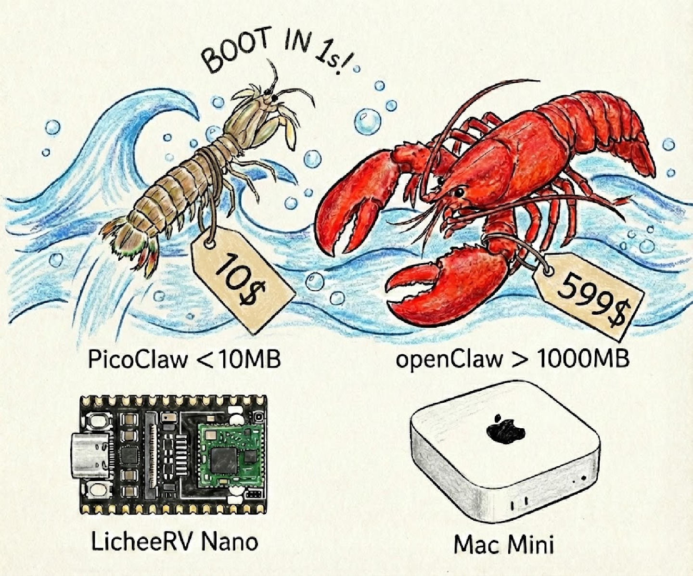

<div align="center">


<h1>AnyClaw: Assistente de IA Ultra-Eficiente em Go</h1>

<h3>Hardware de $10 · 10MB de RAM · Boot em 1s · 皮皮虾，我们走！</h3>

  <p>
    
    
    
    <br>
    <a href="https://AnyClaw.io"></a>
    <a href="https://x.com/SipeedIO"></a>
  </p>

 [中文](README.zh.md) | [日本語](README.ja.md) | **Português** | [Tiếng Việt](README.vi.md) | [Français](README.fr.md) | [English](README.md)
</div>

---

ü¶ê **AnyClaw** √© um assistente pessoal de IA ultra-leve inspirado no [nanobot](https://github.com/HKUDS/nanobot), reescrito do zero em **Go** por meio de um processo de "auto-inicializa√ß√£o" (self-bootstrapping) ‚Ä?onde o pr√≥prio agente de IA conduziu toda a migra√ß√£o de arquitetura e otimiza√ß√£o de c√≥digo.

⚡️ **Extremamente leve:** Roda em hardware de apenas **$10** com **<10MB** de RAM. Isso é 99% menos memória que o OpenClaw e 98% mais barato que um Mac mini!

<table align="center">
<tr align="center">
<td align="center" valign="top">
<p align="center">

</p>
</td>
<td align="center" valign="top">
<p align="center">

</p>
</td>
</tr>
</table>

> [!CAUTION]
> **🚨 DECLARAÇÃO DE SEGURANÇA & CANAIS OFICIAIS**
>
> * **SEM CRIPTOMOEDAS:** O AnyClaw **NÃO** possui nenhum token/moeda oficial. Todas as alegações no `pump.fun` ou outras plataformas de negociação são **GOLPES**.
> * **DOMÍNIO OFICIAL:** O **ÚNICO** site oficial é o **[AnyClaw.io](https://AnyClaw.io)**, e o site da empresa é o **[sipeed.com](https://sipeed.com)**.
> * **Aviso:** Muitos domínios `.ai/.org/.com/.net/...` foram registrados por terceiros, não são nossos.
> * **Aviso:** O AnyClaw está em fase inicial de desenvolvimento e pode ter problemas de segurança de rede não resolvidos. Não implante em ambientes de produção antes da versão v1.0.
> * **Nota:** O AnyClaw recentemente fez merge de muitos PRs, o que pode resultar em maior consumo de memória (10-20MB) nas versões mais recentes. Planejamos priorizar a otimização de recursos assim que o conjunto de funcionalidades estiver estável.


## 📢 Novidades

2026-02-16 üéâ AnyClaw atingiu 12K stars em uma semana! Obrigado a todos pelo apoio! O AnyClaw est√° crescendo mais r√°pido do que jamais imaginamos. Dado o alto volume de PRs, precisamos urgentemente de maintainers da comunidade. Nossos pap√©is de volunt√°rios e roadmap foram publicados oficialmente [aqui](docs/ROADMAP.md) ‚Ä?estamos ansiosos para ter voc√™ a bordo!

2026-02-13 🎉 AnyClaw atingiu 5000 stars em 4 dias! Obrigado à comunidade! Estamos finalizando o **Roadmap do Projeto** e configurando o **Grupo de Desenvolvedores** para acelerar o desenvolvimento do AnyClaw.

🚀 **Chamada para Ação:** Envie suas solicitações de funcionalidades nas GitHub Discussions. Revisaremos e priorizaremos na próxima reunião semanal.

2026-02-09 🎉 AnyClaw lançado oficialmente! Construído em 1 dia para trazer Agentes de IA para hardware de $10 com <10MB de RAM. 🦐 AnyClaw, Partiu!

## ‚ú?Funcionalidades

ü™∂ **Ultra-Leve**: Consumo de mem√≥ria <10MB ‚Ä?99% menor que o Clawdbot para funcionalidades essenciais.

üí∞ **Custo M√≠nimo**: Eficiente o suficiente para rodar em hardware de $10 ‚Ä?98% mais barato que um Mac mini.

⚡️ **Inicialização Relámpago**: Tempo de inicialização 400X mais rápido, boot em 1 segundo mesmo em CPU single-core de 0.6GHz.

üåç **Portabilidade Real**: Um √∫nico bin√°rio auto-contido para RISC-V, ARM, MIPS e x86. Um clique e j√° era!

ü§ñ **Auto-Constru√≠do por IA**: Implementa√ß√£o nativa em Go de forma aut√¥noma ‚Ä?95% do n√∫cleo gerado pelo Agente com refinamento humano no loop.

|                               | OpenClaw      | NanoBot                  | **AnyClaw**                              |
| ----------------------------- | ------------- | ------------------------ | ----------------------------------------- |
| **Linguagem**                 | TypeScript    | Python                   | **Go**                                    |
| **RAM**                       | >1GB          | >100MB                   | **< 10MB**                                |
| **Inicialização**</br>(CPU 0.8GHz) | >500s         | >30s                     | **<1s**                                   |
| **Custo**                     | Mac Mini $599 | Maioria dos SBC Linux </br>~$50 | **Qualquer placa Linux**</br>**A partir de $10** |



## 🦾 Demonstração

### üõ†Ô∏?Fluxos de Trabalho Padr√£o do Assistente

<table align="center">
<tr align="center">
<th><p align="center">üß© Engenharia Full-Stack</p></th>
<th><p align="center">üóÇÔ∏?Gerenciamento de Logs & Planejamento</p></th>
<th><p align="center">üîé Busca Web & Aprendizado</p></th>
</tr>
<tr>
<td align="center"><p align="center"></p></td>
<td align="center"><p align="center"></p></td>
<td align="center"><p align="center"></p></td>
</tr>
<tr>
<td align="center">Desenvolver ‚Ä?Implantar ‚Ä?Escalar</td>
<td align="center">Agendar ‚Ä?Automatizar ‚Ä?Memorizar</td>
<td align="center">Descobrir ‚Ä?Analisar ‚Ä?Tend√™ncias</td>
</tr>
</table>

### üì± Rode em celulares Android antigos

Dê uma segunda vida ao seu celular de dez anos atrás! Transforme-o em um assistente de IA inteligente com o AnyClaw. Início rápido:

1. **Instale o Termux** (Disponível no F-Droid ou Google Play).
2. **Execute os comandos**

```bash
# Nota: Substitua v0.1.1 pela versao mais recente da pagina de Releases
wget https://github.com/anyclaw/anyclaw-server/releases/download/v0.1.1/AnyClaw-linux-arm64
chmod +x AnyClaw-linux-arm64
pkg install proot
termux-chroot ./AnyClaw-linux-arm64 onboard
```

Depois siga as instruções na seção "Início Rápido" para completar a configuração!


### 🐜 Implantação Inovadora com Baixo Consumo

O AnyClaw pode ser implantado em praticamente qualquer dispositivo Linux!

- $9.9 [LicheeRV-Nano](https://www.aliexpress.com/item/1005006519668532.html) versão E (Ethernet) ou W (WiFi6), para Assistente Doméstico Minimalista
- $30~50 [NanoKVM](https://www.aliexpress.com/item/1005007369816019.html), ou $100 [NanoKVM-Pro](https://www.aliexpress.com/item/1005010048471263.html) para Manutenção Automatizada de Servidores
- $50 [MaixCAM](https://www.aliexpress.com/item/1005008053333693.html) ou $100 [MaixCAM2](https://www.kickstarter.com/projects/zepan/maixcam2-build-your-next-gen-4k-ai-camera) para Monitoramento Inteligente

https://private-user-images.githubusercontent.com/83055338/547056448-e7b031ff-d6f5-4468-bcca-5726b6fecb5c.mp4

🌟 Mais cenários de implantação aguardam você!

## 📦 Instalação

### Instalar com binário pré-compilado

Baixe o bin√°rio para sua plataforma na p√°gina de [releases](https://github.com/anyclaw/anyclaw-server/releases).

### Instalar a partir do código-fonte (funcionalidades mais recentes, recomendado para desenvolvimento)

```bash
git clone https://github.com/anyclaw/anyclaw-server.git

cd AnyClaw
make deps

# Build, sem necessidade de instalar
make build

# Build para multiplas plataformas
make build-all

# Build e Instalar
make install
```

## üê≥ Docker Compose

Você tambêm pode rodar o AnyClaw usando Docker Compose sem instalar nada localmente.

```bash
# 1. Clone este repositorio
git clone https://github.com/anyclaw/anyclaw-server.git
cd AnyClaw

# 2. Primeiro uso ‚Ä?gera docker/data/config.json automaticamente e para
docker compose -f docker/docker-compose.yml --profile gateway up
# O contêiner exibe "First-run setup complete." e para.

# 3. Configure suas API keys
vim docker/data/config.json   # Chaves de API do provedor, tokens de bot, etc.

# 4. Iniciar
docker compose -f docker/docker-compose.yml --profile gateway up -d
```

> [!TIP]
> **Usuários Docker**: Por padrão, o Gateway ouve em `127.0.0.1`, o que não é acessível a partir do host. Se você precisar acessar os endpoints de integridade ou expor portas, defina `AnyClaw_GATEWAY_HOST=0.0.0.0` em seu ambiente ou atualize o `config.json`.

```bash
# 5. Ver logs
docker compose -f docker/docker-compose.yml logs -f AnyClaw-gateway

# 6. Parar
docker compose -f docker/docker-compose.yml --profile gateway down
```

### Modo Agente (Execução única)

```bash
# Fazer uma pergunta
docker compose -f docker/docker-compose.yml run --rm AnyClaw-agent -m "Quanto e 2+2?"

# Modo interativo
docker compose -f docker/docker-compose.yml run --rm AnyClaw-agent
```

### Atualizar

```bash
docker compose -f docker/docker-compose.yml pull
docker compose -f docker/docker-compose.yml --profile gateway up -d
```

### 🚀 Início Rápido

> [!TIP]
> Configure sua API key em `~/.AnyClaw/config.json`.
> Obtenha API keys: [OpenRouter](https://openrouter.ai/keys) (LLM) · [Zhipu](https://open.bigmodel.cn/usercenter/proj-mgmt/apikeys) (LLM)
> Busca web e **opcional** ‚Ä?obtenha a [Brave Search API](https://brave.com/search/api) gratuita (2000 consultas gr√°tis/m√™s) ou use o fallback autom√°tico integrado.

**1. Inicializar**

```bash
AnyClaw onboard
```

**2. Configurar** (`~/.AnyClaw/config.json`)

```json
{
  "model_list": [
    {
      "model_name": "gpt4",
      "model": "openai/gpt-5.2",
      "api_key": "sk-your-openai-key",
      "request_timeout": 300,
      "api_base": "https://api.openai.com/v1"
    }
  ],
  "agents": {
    "defaults": {
      "model_name": "gpt4"
    }
  },
  "tools": {
    "web": {
      "brave": {
        "enabled": false,
        "api_key": "YOUR_BRAVE_API_KEY",
        "max_results": 5
      },
      "duckduckgo": {
        "enabled": true,
        "max_results": 5
      }
    }
  }
}
```

> **Novo**: O formato de configuração `model_list` permite adicionar provedores sem alterar código. Veja [Configuração de Modelo](#configuração-de-modelo-model_list) para detalhes.
> `request_timeout` é opcional e usa segundos. Se omitido ou definido como `<= 0`, o AnyClaw usa o timeout padrão (120s).

**3. Obter API Keys**

* **Provedor de LLM**: [OpenRouter](https://openrouter.ai/keys) · [Zhipu](https://open.bigmodel.cn/usercenter/proj-mgmt/apikeys) · [Anthropic](https://console.anthropic.com) · [OpenAI](https://platform.openai.com) · [Gemini](https://aistudio.google.com/api-keys)
* **Busca Web** (opcional): [Brave Search](https://brave.com/search/api) - Plano gratuito disponível (2000 consultas/mês)

> **Nota**: Veja `config.example.json` para um modelo de configuração completo.

**4. Conversar**

```bash
AnyClaw agent -m "Quanto e 2+2?"
```

Pronto! Você tem um assistente de IA funcionando em 2 minutos.

---

## 💬 Integração com Apps de Chat

Converse com seu AnyClaw via Telegram, Discord, DingTalk, LINE ou WeCom.

| Canal | Nível de Configuração |
| --- | --- |
| **Telegram** | F√°cil (apenas um token) |
| **Discord** | F√°cil (bot token + intents) |
| **QQ** | F√°cil (AppID + AppSecret) |
| **DingTalk** | Médio (credenciais do app) |
| **LINE** | Médio (credenciais + webhook URL) |
| **WeCom AI Bot** | Médio (Token + chave AES) |

<details>
<summary><b>Telegram</b> (Recomendado)</summary>

**1. Criar o bot**

* Abra o Telegram, busque `@BotFather`
* Envie `/newbot`, siga as instruções
* Copie o token

**2. Configurar**

```json
{
  "channels": {
    "telegram": {
      "enabled": true,
      "token": "YOUR_BOT_TOKEN",
      "allow_from": ["YOUR_USER_ID"]
    }
  }
}
```

> Obtenha seu User ID pelo `@userinfobot` no Telegram.

**3. Executar**

```bash
AnyClaw gateway
```

</details>

<details>
<summary><b>Discord</b></summary>

**1. Criar o bot**

* Acesse <https://discord.com/developers/applications>
* Crie um aplicativo ‚Ü?Bot ‚Ü?Add Bot
* Copie o token do bot

**2. Habilitar Intents**

* Nas configurações do Bot, habilite **MESSAGE CONTENT INTENT**
* (Opcional) Habilite **SERVER MEMBERS INTENT** se quiser usar lista de permissões baseada em dados dos membros

**3. Obter seu User ID**

* Configura√ß√µes do Discord ‚Ü?Avan√ßado ‚Ü?habilite **Modo Desenvolvedor**
* Clique com bot√£o direito no seu avatar ‚Ü?**Copiar ID do Usu√°rio**

**4. Configurar**

```json
{
  "channels": {
    "discord": {
      "enabled": true,
      "token": "YOUR_BOT_TOKEN",
      "allow_from": ["YOUR_USER_ID"]
    }
  }
}
```

**5. Convidar o bot**

* OAuth2 ‚Ü?URL Generator
* Scopes: `bot`
* Bot Permissions: `Send Messages`, `Read Message History`
* Abra a URL de convite gerada e adicione o bot ao seu servidor

**6. Executar**

```bash
AnyClaw gateway
```

</details>

<details>
<summary><b>QQ</b></summary>

**1. Criar o bot**

- Acesse a [QQ Open Platform](https://q.qq.com/#)
- Crie um aplicativo ‚Ü?Obtenha **AppID** e **AppSecret**

**2. Configurar**

```json
{
  "channels": {
    "qq": {
      "enabled": true,
      "app_id": "YOUR_APP_ID",
      "app_secret": "YOUR_APP_SECRET",
      "allow_from": []
    }
  }
}
```

> Deixe `allow_from` vazio para permitir todos os usu√°rios, ou especifique n√∫meros QQ para restringir o acesso.

**3. Executar**

```bash
AnyClaw gateway
```

</details>

<details>
<summary><b>DingTalk</b></summary>

**1. Criar o bot**

* Acesse a [Open Platform](https://open.dingtalk.com/)
* Crie um app interno
* Copie o Client ID e Client Secret

**2. Configurar**

```json
{
  "channels": {
    "dingtalk": {
      "enabled": true,
      "client_id": "YOUR_CLIENT_ID",
      "client_secret": "YOUR_CLIENT_SECRET",
      "allow_from": []
    }
  }
}
```

> Deixe `allow_from` vazio para permitir todos os usu√°rios, ou especifique IDs para restringir o acesso.

**3. Executar**

```bash
AnyClaw gateway
```

</details>

<details>
<summary><b>LINE</b></summary>

**1. Criar uma Conta Oficial LINE**

- Acesse o [LINE Developers Console](https://developers.line.biz/)
- Crie um provider ‚Ü?Crie um canal Messaging API
- Copie o **Channel Secret** e o **Channel Access Token**

**2. Configurar**

```json
{
  "channels": {
    "line": {
      "enabled": true,
      "channel_secret": "YOUR_CHANNEL_SECRET",
      "channel_access_token": "YOUR_CHANNEL_ACCESS_TOKEN",
      "webhook_path": "/webhook/line",
      "allow_from": []
    }
  }
}
```

**3. Configurar URL do Webhook**

O LINE requer HTTPS para webhooks. Use um reverse proxy ou tunnel:

```bash
# Exemplo com ngrok
ngrok http 18790
```

Em seguida, configure a Webhook URL no LINE Developers Console para `https://seu-dominio/webhook/line` e habilite **Use webhook**.

> **Nota**: O webhook do LINE é servido pelo Gateway compartilhado (padrão 127.0.0.1:18790). Use um proxy reverso/HTTPS ou túnel (como ngrok) para expor o Gateway de forma segura quando necessário.

**4. Executar**

```bash
AnyClaw gateway
```

> Em chats de grupo, o bot responde apenas quando mencionado com @. As respostas citam a mensagem original.

> **Docker Compose**: Se você usa Docker Compose, exponha o Gateway (padrão 127.0.0.1:18790) se precisar acessar o webhook LINE externamente, por exemplo `ports: ["18790:18790"]`.

</details>

<details>
<summary><b>WeCom (WeChat Work)</b></summary>

O AnyClaw suporta três tipos de integração WeCom:

**Opção 1: WeCom Bot (Robô)** - Configuração mais fácil, suporta chats em grupo
**Opção 2: WeCom App (Aplicativo Personalizado)** - Mais recursos, mensagens proativas, somente chat privado
**Opção 3: WeCom AI Bot (Robô Inteligente)** - Bot IA oficial, respostas em streaming, suporta grupo e privado

Veja o [Guia de Configuração WeCom AI Bot](docs/channels/wecom/wecom_aibot/README.zh.md) para instruções detalhadas.

**Configuração Rápida - WeCom Bot:**

**1. Criar um bot**

* Acesse o Console de Administra√ß√£o WeCom ‚Ü?Chat em Grupo ‚Ü?Adicionar Bot de Grupo
* Copie a URL do webhook (formato: `https://qyapi.weixin.qq.com/cgi-bin/webhook/send?key=xxx`)

**2. Configurar**

```json
{
  "channels": {
    "wecom": {
      "enabled": true,
      "token": "YOUR_TOKEN",
      "encoding_aes_key": "YOUR_ENCODING_AES_KEY",
      "webhook_url": "https://qyapi.weixin.qq.com/cgi-bin/webhook/send?key=YOUR_KEY",
      "webhook_path": "/webhook/wecom",
      "allow_from": []
    }
  }
}
```

> **Nota**: O webhook do WeCom Bot é atendido pelo Gateway compartilhado (padrão 127.0.0.1:18790). Use um proxy reverso/HTTPS ou túnel para expor o Gateway em produção.

**Configuração Rápida - WeCom App:**

**1. Criar um aplicativo**

* Acesse o Console de Administra√ß√£o WeCom ‚Ü?Gerenciamento de Aplicativos ‚Ü?Criar Aplicativo
* Copie o **AgentId** e o **Secret**
* Acesse a p√°gina "Minha Empresa", copie o **CorpID**

**2. Configurar recebimento de mensagens**

* Nos detalhes do aplicativo, clique em "Receber Mensagens" ‚Ü?"Configurar API"
* Defina a URL como `http://your-server:18790/webhook/wecom-app`
* Gere o **Token** e o **EncodingAESKey**

**3. Configurar**

```json
{
  "channels": {
    "wecom_app": {
      "enabled": true,
      "corp_id": "wwxxxxxxxxxxxxxxxx",
      "corp_secret": "YOUR_CORP_SECRET",
      "agent_id": 1000002,
      "token": "YOUR_TOKEN",
      "encoding_aes_key": "YOUR_ENCODING_AES_KEY",
      "webhook_path": "/webhook/wecom-app",
      "allow_from": []
    }
  }
}
```

**4. Executar**

```bash
AnyClaw gateway
```

> **Nota**: O WeCom App (callbacks de webhook) é servido pelo Gateway compartilhado (padrão 127.0.0.1:18790). Em produção use um proxy reverso HTTPS para expor a porta do Gateway, ou atualize `AnyClaw_GATEWAY_HOST` para `0.0.0.0` se necessário.

**Configuração Rápida - WeCom AI Bot:**

**1. Criar um AI Bot**

* Acesse o Console de Administra√ß√£o WeCom ‚Ü?Gerenciamento de Aplicativos ‚Ü?AI Bot
* Configure a URL de callback: `http://your-server:18791/webhook/wecom-aibot`
* Copie o **Token** e gere o **EncodingAESKey**

**2. Configurar**

```json
{
  "channels": {
    "wecom_aibot": {
      "enabled": true,
      "token": "YOUR_TOKEN",
      "encoding_aes_key": "YOUR_43_CHAR_ENCODING_AES_KEY",
      "webhook_path": "/webhook/wecom-aibot",
      "allow_from": [],
      "welcome_message": "Ol√°! Como posso ajud√°-lo?"
    }
  }
}
```

**3. Executar**

```bash
AnyClaw gateway
```

> **Nota**: O WeCom AI Bot usa protocolo de pull em streaming ‚Ä?sem preocupa√ß√µes com timeout de resposta. Tarefas longas (>5,5 min) alternam automaticamente para entrega via `response_url`.

</details>

##  Junte-se a Rede Social de Agentes

Conecte o AnyClaw a Rede Social de Agentes simplesmente enviando uma √∫nica mensagem via CLI ou qualquer App de Chat integrado.

**Leia `https://clawdchat.ai/skill.md` e siga as instruções para entrar no [ClawdChat.ai](https://clawdchat.ai)**

## ⚙️ Configuração Detalhada

Arquivo de configuração: `~/.AnyClaw/config.json`

### Vari√°veis de Ambiente

Você pode substituir os caminhos padrão usando variáveis de ambiente. Isso é útil para instalações portáteis, implantações em contêineres ou para executar o AnyClaw como um serviço do sistema. Essas variáveis são independentes e controlam caminhos diferentes.

| Variável          | Descrição                                                                                                                             | Caminho Padrão            |
|-------------------|-----------------------------------------------------------------------------------------------------------------------------------------|---------------------------|
| `AnyClaw_CONFIG` | Substitui o caminho para o arquivo de configuração. Isso informa diretamente ao AnyClaw qual `config.json` carregar, ignorando todos os outros locais. | `~/.AnyClaw/config.json` |
| `AnyClaw_HOME`   | Substitui o diretório raiz dos dados do AnyClaw. Isso altera o local padrão do `workspace` e de outros diretórios de dados.          | `~/.AnyClaw`             |

**Exemplos:**

```bash
# Executar o AnyClaw usando um arquivo de configuração específico
# O caminho do workspace será lido de dentro desse arquivo de configuração
AnyClaw_CONFIG=/etc/AnyClaw/production.json AnyClaw gateway

# Executar o AnyClaw com todos os seus dados armazenados em /opt/AnyClaw
# A configuração será carregada do ~/.AnyClaw/config.json padrão
# O workspace ser√° criado em /opt/AnyClaw/workspace
AnyClaw_HOME=/opt/AnyClaw AnyClaw agent

# Use ambos para uma configuração totalmente personalizada
AnyClaw_HOME=/srv/AnyClaw AnyClaw_CONFIG=/srv/AnyClaw/main.json AnyClaw gateway
```

### Estrutura do Workspace

O AnyClaw armazena dados no workspace configurado (padr√£o: `~/.AnyClaw/workspace`):

```
~/.AnyClaw/workspace/
├── sessions/          # Sessoes de conversa e historico
├── memory/            # Memoria de longo prazo (MEMORY.md)
├── state/             # Estado persistente (ultimo canal, etc.)
├── cron/              # Banco de dados de tarefas agendadas
├── skills/            # Skills personalizadas
├── AGENTS.md          # Guia de comportamento do Agente
├── HEARTBEAT.md       # Prompts de tarefas periodicas (verificado a cada 30 min)
├── IDENTITY.md        # Identidade do Agente
├── SOUL.md            # Alma do Agente
├── TOOLS.md           # Descrição das ferramentas
└── USER.md            # Preferencias do usuario
```

### 🔒 Sandbox de Segurança

O AnyClaw roda em um ambiente sandbox por padr√£o. O agente so pode acessar arquivos e executar comandos dentro do workspace configurado.

#### Configuração Padrão

```json
{
  "agents": {
    "defaults": {
      "workspace": "~/.AnyClaw/workspace",
      "restrict_to_workspace": true
    }
  }
}
```

| Opção | Padrão | Descrição |
|-------|--------|-----------|
| `workspace` | `~/.AnyClaw/workspace` | Diretório de trabalho do agente |
| `restrict_to_workspace` | `true` | Restringir acesso de arquivos/comandos ao workspace |

#### Ferramentas Protegidas

Quando `restrict_to_workspace: true`, as seguintes ferramentas s√£o restritas ao sandbox:

| Ferramenta | Função | Restrição |
|------------|--------|-----------|
| `read_file` | Ler arquivos | Apenas arquivos dentro do workspace |
| `write_file` | Escrever arquivos | Apenas arquivos dentro do workspace |
| `list_dir` | Listar diretorios | Apenas diretorios dentro do workspace |
| `edit_file` | Editar arquivos | Apenas arquivos dentro do workspace |
| `append_file` | Adicionar a arquivos | Apenas arquivos dentro do workspace |
| `exec` | Executar comandos | Caminhos dos comandos devem estar dentro do workspace |

#### Proteção Adicional do Exec

Mesmo com `restrict_to_workspace: false`, a ferramenta `exec` bloqueia estes comandos perigosos:

* `rm -rf`, `del /f`, `rmdir /s` ‚Ä?Exclus√£o em massa
* `format`, `mkfs`, `diskpart` ‚Ä?Formata√ß√£o de disco
* `dd if=` ‚Ä?Cria√ß√£o de imagem de disco
* Escrita em `/dev/sd[a-z]` ‚Ä?Escrita direta no disco
* `shutdown`, `reboot`, `poweroff` ‚Ä?Desligamento do sistema
* Fork bomb `:(){ :|:& };:`

#### Exemplos de Erro

```
[ERROR] tool: Tool execution failed
{tool=exec, error=Command blocked by safety guard (path outside working dir)}
```

```
[ERROR] tool: Tool execution failed
{tool=exec, error=Command blocked by safety guard (dangerous pattern detected)}
```

#### Desabilitar Restrições (Risco de Segurança)

Se você precisa que o agente acesse caminhos fora do workspace:

**Método 1: Arquivo de configuração**

```json
{
  "agents": {
    "defaults": {
      "restrict_to_workspace": false
    }
  }
}
```

**Método 2: Variável de ambiente**

```bash
export AnyClaw_AGENTS_DEFAULTS_RESTRICT_TO_WORKSPACE=false
```

> ⚠️ **Aviso**: Desabilitar esta restrição permite que o agente acesse qualquer caminho no seu sistema. Use com cuidado apenas em ambientes controlados.

#### Consistência do Limite de Segurança

A configuração `restrict_to_workspace` se aplica consistentemente em todos os caminhos de execução:

| Caminho de Execução | Limite de Segurança |
|----------------------|---------------------|
| Agente Principal | `restrict_to_workspace` ‚ú?|
| Subagente / Spawn | Herda a mesma restri√ß√£o ‚ú?|
| Tarefas Heartbeat | Herda a mesma restri√ß√£o ‚ú?|

Todos os caminhos compartilham a mesma restri√ß√£o de workspace ‚Ä?nao h√° como contornar o limite de seguran√ßa por meio de subagentes ou tarefas agendadas.

### Heartbeat (Tarefas Periódicas)

O AnyClaw pode executar tarefas periódicas automaticamente. Crie um arquivo `HEARTBEAT.md` no seu workspace:

```markdown
# Tarefas Periodicas

- Verificar meu email para mensagens importantes
- Revisar minha agenda para proximos eventos
- Verificar a previsao do tempo
```

O agente lerá este arquivo a cada 30 minutos (configurável) e executará as tarefas usando as ferramentas disponíveis.

#### Tarefas Assincronas com Spawn

Para tarefas de longa duração (busca web, chamadas de API), use a ferramenta `spawn` para criar um **subagente**:

```markdown
# Tarefas Periódicas

## Tarefas R√°pidas (resposta direta)
- Informar hora atual

## Tarefas Longas (usar spawn para async)
- Buscar notícias de IA na web e resumir
- Verificar email e reportar mensagens importantes
```

**Comportamentos principais:**

| Funcionalidade | Descrição |
|----------------|-----------|
| **spawn** | Cria subagente assíncrono, não bloqueia o heartbeat |
| **Contexto independente** | Subagente tem seu próprio contexto, sem histórico de sessão |
| **Ferramenta message** | Subagente se comunica diretamente com o usu√°rio via ferramenta message |
| **Não-bloqueante** | Após o spawn, o heartbeat continua para a próxima tarefa |

#### Como Funciona a Comunicação do Subagente

```
Heartbeat dispara
    ‚Ü?Agente l√™ HEARTBEAT.md
    ‚Ü?Para tarefa longa: spawn subagente
    ‚Ü?                          ‚Ü?Continua pr√≥xima tarefa    Subagente trabalha independentemente
    ‚Ü?                          ‚Ü?Todas tarefas conclu√≠das   Subagente usa ferramenta "message"
    ‚Ü?                          ‚Ü?Responde HEARTBEAT_OK      Usu√°rio recebe resultado diretamente
```

O subagente tem acesso às ferramentas (message, web_search, etc.) e pode se comunicar com o usuário independentemente sem passar pelo agente principal.

**Configuração:**

```json
{
  "heartbeat": {
    "enabled": true,
    "interval": 30
  }
}
```

| Opção | Padrão | Descrição |
|-------|--------|-----------|
| `enabled` | `true` | Habilitar/desabilitar heartbeat |
| `interval` | `30` | Intervalo de verificação em minutos (min: 5) |

**Vari√°veis de ambiente:**

* `AnyClaw_HEARTBEAT_ENABLED=false` para desabilitar
* `AnyClaw_HEARTBEAT_INTERVAL=60` para alterar o intervalo

### Provedores

> [!NOTE]
> O Groq fornece transcrição de voz gratuita via Whisper. Se configurado, mensagens de áudio de qualquer canal serão automaticamente transcritas no nível do agente.

| Provedor | Finalidade | Obter API Key |
| --- | --- | --- |
| `gemini` | LLM (Gemini direto) | [aistudio.google.com](https://aistudio.google.com) |
| `zhipu` | LLM (Zhipu direto) | [bigmodel.cn](bigmodel.cn) |
| `openrouter` (Em teste) | LLM (recomendado, acesso a todos os modelos) | [openrouter.ai](https://openrouter.ai) |
| `anthropic` (Em teste) | LLM (Claude direto) | [console.anthropic.com](https://console.anthropic.com) |
| `openai` (Em teste) | LLM (GPT direto) | [platform.openai.com](https://platform.openai.com) |
| `deepseek` (Em teste) | LLM (DeepSeek direto) | [platform.deepseek.com](https://platform.deepseek.com) |
| `qwen` | Alibaba Qwen | [dashscope.console.aliyun.com](https://dashscope.console.aliyun.com) |
| `cerebras` | Cerebras | [cerebras.ai](https://cerebras.ai) |
| `groq` | LLM + **Transcrição de voz** (Whisper) | [console.groq.com](https://console.groq.com) |

<details>
<summary><b>Configuração Zhipu</b></summary>

**1. Obter API key**

* Obtenha a [API key](https://bigmodel.cn/usercenter/proj-mgmt/apikeys)

**2. Configurar**

```json
{
  "agents": {
    "defaults": {
      "workspace": "~/.AnyClaw/workspace",
      "model": "glm-4.7",
      "max_tokens": 8192,
      "temperature": 0.7,
      "max_tool_iterations": 20
    }
  },
  "providers": {
    "zhipu": {
      "api_key": "Sua API Key",
      "api_base": "https://open.bigmodel.cn/api/paas/v4"
    }
  }
}
```

**3. Executar**

```bash
AnyClaw agent -m "Ola, como vai?"
```

</details>

<details>
<summary><b>Exemplo de configuraçao completa</b></summary>

```json
{
  "agents": {
    "defaults": {
      "model": "anthropic/claude-opus-4-5"
    }
  },
  "providers": {
    "openrouter": {
      "api_key": "sk-or-v1-xxx"
    },
    "groq": {
      "api_key": "gsk_xxx"
    }
  },
  "channels": {
    "telegram": {
      "enabled": true,
      "token": "123456:ABC...",
      "allow_from": ["123456789"]
    },
    "discord": {
      "enabled": true,
      "token": "",
      "allow_from": [""]
    },
    "whatsapp": {
      "enabled": false
    },
    "feishu": {
      "enabled": false,
      "app_id": "cli_xxx",
      "app_secret": "xxx",
      "encrypt_key": "",
      "verification_token": "",
      "allow_from": []
    },
    "qq": {
      "enabled": false,
      "app_id": "",
      "app_secret": "",
      "allow_from": []
    }
  },
  "tools": {
    "web": {
      "brave": {
        "enabled": false,
        "api_key": "BSA...",
        "max_results": 5
      },
      "duckduckgo": {
        "enabled": true,
        "max_results": 5
      }
    },
    "cron": {
      "exec_timeout_minutes": 5
    }
  },
  "heartbeat": {
    "enabled": true,
    "interval": 30
  }
}
```

</details>

### Configuração de Modelo (model_list)

> **Novidade!** AnyClaw agora usa uma abordagem de configura√ß√£o **centrada no modelo**. Basta especificar o formato `fornecedor/modelo` (ex: `zhipu/glm-4.7`) para adicionar novos provedores‚Ä?*nenhuma altera√ß√£o de c√≥digo necess√°ria!**

Este design também possibilita o **suporte multi-agent** com seleção flexível de provedores:

- **Diferentes agentes, diferentes provedores** : Cada agente pode usar seu próprio provedor LLM
- **Modelos de fallback** : Configure modelos primários e de reserva para resiliência
- **Balanceamento de carga** : Distribua solicitações entre múltiplos endpoints
- **Configuração centralizada** : Gerencie todos os provedores em um só lugar

#### üìã Todos os Fornecedores Suportados

| Fornecedor | Prefixo `model` | API Base Padr√£o | Protocolo | Chave API |
|-------------|-----------------|------------------|----------|-----------|
| **OpenAI** | `openai/` | `https://api.openai.com/v1` | OpenAI | [Obter Chave](https://platform.openai.com) |
| **Anthropic** | `anthropic/` | `https://api.anthropic.com/v1` | Anthropic | [Obter Chave](https://console.anthropic.com) |
| **Zhipu AI (GLM)** | `zhipu/` | `https://open.bigmodel.cn/api/paas/v4` | OpenAI | [Obter Chave](https://open.bigmodel.cn/usercenter/proj-mgmt/apikeys) |
| **DeepSeek** | `deepseek/` | `https://api.deepseek.com/v1` | OpenAI | [Obter Chave](https://platform.deepseek.com) |
| **Google Gemini** | `gemini/` | `https://generativelanguage.googleapis.com/v1beta` | OpenAI | [Obter Chave](https://aistudio.google.com/api-keys) |
| **Groq** | `groq/` | `https://api.groq.com/openai/v1` | OpenAI | [Obter Chave](https://console.groq.com) |
| **Moonshot** | `moonshot/` | `https://api.moonshot.cn/v1` | OpenAI | [Obter Chave](https://platform.moonshot.cn) |
| **Qwen (Alibaba)** | `qwen/` | `https://dashscope.aliyuncs.com/compatible-mode/v1` | OpenAI | [Obter Chave](https://dashscope.console.aliyun.com) |
| **NVIDIA** | `nvidia/` | `https://integrate.api.nvidia.com/v1` | OpenAI | [Obter Chave](https://build.nvidia.com) |
| **Ollama** | `ollama/` | `http://localhost:11434/v1` | OpenAI | Local (sem chave necess√°ria) |
| **OpenRouter** | `openrouter/` | `https://openrouter.ai/api/v1` | OpenAI | [Obter Chave](https://openrouter.ai/keys) |
| **VLLM** | `vllm/` | `http://localhost:8000/v1` | OpenAI | Local |
| **Cerebras** | `cerebras/` | `https://api.cerebras.ai/v1` | OpenAI | [Obter Chave](https://cerebras.ai) |
| **Volcengine** | `volcengine/` | `https://ark.cn-beijing.volces.com/api/v3` | OpenAI | [Obter Chave](https://console.volcengine.com) |
| **ShengsuanYun** | `shengsuanyun/` | `https://router.shengsuanyun.com/api/v1` | OpenAI | - |
| **Antigravity** | `antigravity/` | Google Cloud | Custom | Apenas OAuth |
| **GitHub Copilot** | `github-copilot/` | `localhost:4321` | gRPC | - |

#### Configuração Básica

```json
{
  "model_list": [
    {
      "model_name": "gpt-5.2",
      "model": "openai/gpt-5.2",
      "api_key": "sk-your-openai-key"
    },
    {
      "model_name": "claude-sonnet-4.6",
      "model": "anthropic/claude-sonnet-4.6",
      "api_key": "sk-ant-your-key"
    },
    {
      "model_name": "glm-4.7",
      "model": "zhipu/glm-4.7",
      "api_key": "your-zhipu-key"
    }
  ],
  "agents": {
    "defaults": {
      "model": "gpt-5.2"
    }
  }
}
```

#### Exemplos por Fornecedor

**OpenAI**
```json
{
  "model_name": "gpt-5.2",
  "model": "openai/gpt-5.2",
  "api_key": "sk-..."
}
```

**Zhipu AI (GLM)**
```json
{
  "model_name": "glm-4.7",
  "model": "zhipu/glm-4.7",
  "api_key": "your-key"
}
```

**Anthropic (com OAuth)**
```json
{
  "model_name": "claude-sonnet-4.6",
  "model": "anthropic/claude-sonnet-4.6",
  "auth_method": "oauth"
}
```
> Execute `AnyClaw auth login --provider anthropic` para configurar credenciais OAuth.

**Proxy/API personalizada**
```json
{
  "model_name": "my-custom-model",
  "model": "openai/custom-model",
  "api_base": "https://my-proxy.com/v1",
  "api_key": "sk-...",
  "request_timeout": 300
}
```

#### Balanceamento de Carga

Configure vários endpoints para o mesmo nome de modelo—AnyClaw fará round-robin automaticamente entre eles:

```json
{
  "model_list": [
    {
      "model_name": "gpt-5.2",
      "model": "openai/gpt-5.2",
      "api_base": "https://api1.example.com/v1",
      "api_key": "sk-key1"
    },
    {
      "model_name": "gpt-5.2",
      "model": "openai/gpt-5.2",
      "api_base": "https://api2.example.com/v1",
      "api_key": "sk-key2"
    }
  ]
}
```

#### Migração da Configuração Legada `providers`

A configuração antiga `providers` está **descontinuada** mas ainda é suportada para compatibilidade reversa.

**Configuração Antiga (descontinuada):**
```json
{
  "providers": {
    "zhipu": {
      "api_key": "your-key",
      "api_base": "https://open.bigmodel.cn/api/paas/v4"
    }
  },
  "agents": {
    "defaults": {
      "provider": "zhipu",
      "model": "glm-4.7"
    }
  }
}
```

**Nova Configuração (recomendada):**
```json
{
  "model_list": [
    {
      "model_name": "glm-4.7",
      "model": "zhipu/glm-4.7",
      "api_key": "your-key"
    }
  ],
  "agents": {
    "defaults": {
      "model": "glm-4.7"
    }
  }
}
```

Para o guia de migração detalhado, consulte [docs/migration/model-list-migration.md](docs/migration/model-list-migration.md).

## Referência CLI

| Comando | Descrição |
| --- | --- |
| `AnyClaw onboard` | Inicializar configuração & workspace |
| `AnyClaw agent -m "..."` | Conversar com o agente |
| `AnyClaw agent` | Modo de chat interativo |
| `AnyClaw gateway` | Iniciar o gateway (para bots de chat) |
| `AnyClaw status` | Mostrar status |
| `AnyClaw cron list` | Listar todas as tarefas agendadas |
| `AnyClaw cron add ...` | Adicionar uma tarefa agendada |

### Tarefas Agendadas / Lembretes

O AnyClaw suporta lembretes agendados e tarefas recorrentes por meio da ferramenta `cron`:

* **Lembretes √∫nicos**: "Remind me in 10 minutes" (Me lembre em 10 minutos) ‚Ü?dispara uma vez ap√≥s 10min
* **Tarefas recorrentes**: "Remind me every 2 hours" (Me lembre a cada 2 horas) ‚Ü?dispara a cada 2 horas
* **Express√µes Cron**: "Remind me at 9am daily" (Me lembre √†s 9h todos os dias) ‚Ü?usa express√£o cron

As tarefas s√£o armazenadas em `~/.AnyClaw/workspace/cron/` e processadas automaticamente.

## 🤝 Contribuir & Roadmap

PRs são bem-vindos! O código-fonte é intencionalmente pequeno e legível. 🤗

Roadmap em breve...

Grupo de desenvolvedores em formação. Requisito de entrada: Pelo menos 1 PR com merge.

Grupos de usu√°rios:

Discord: <https://discord.gg/V4sAZ9XWpN>


## 🐛 Solução de Problemas

### Busca web mostra "API 配置问题"

Isso é normal se você ainda não configurou uma API key de busca. O AnyClaw fornecerá links úteis para busca manual.

Para habilitar a busca web:

1. **Opção 1 (Recomendado)**: Obtenha uma API key gratuita em [https://brave.com/search/api](https://brave.com/search/api) (2000 consultas grátis/mês) para os melhores resultados.
2. **Opção 2 (Sem Cartão de Crédito)**: Se você não tem uma key, o sistema automaticamente usa o **DuckDuckGo** como fallback (sem necessidade de key).

Adicione a key em `~/.AnyClaw/config.json` se usar o Brave:

```json
{
  "tools": {
    "web": {
      "brave": {
        "enabled": false,
        "api_key": "YOUR_BRAVE_API_KEY",
        "max_results": 5
      },
      "duckduckgo": {
        "enabled": true,
        "max_results": 5
      }
    }
  }
}
```

### Erros de filtragem de conte√∫do

Alguns provedores (como Zhipu) possuem filtragem de conte√∫do. Tente reformular sua pergunta ou use um modelo diferente.

### Bot do Telegram diz "Conflict: terminated by other getUpdates"

Isso acontece quando outra instância do bot está em execução. Certifique-se de que apenas um `AnyClaw gateway` esteja rodando por vez.

---

## 📝 Comparação de API Keys

| Serviço | Plano Gratuito | Caso de Uso |
| --- | --- | --- |
| **OpenRouter** | 200K tokens/mês | Múltiplos modelos (Claude, GPT-4, etc.) |
| **Zhipu** | 200K tokens/mês | Melhor para usuários chineses |
| **Brave Search** | 2000 consultas/mês | Funcionalidade de busca web |
| **Groq** | Plano gratuito disponível | Inferência ultra-rápida (Llama, Mixtral) |
| **Cerebras** | Plano gratuito disponível | Inferência ultra-rápida (Llama 3.3 70B) |
